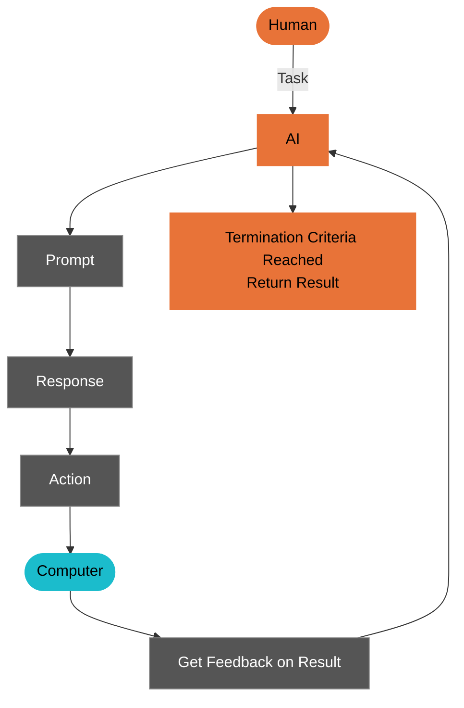
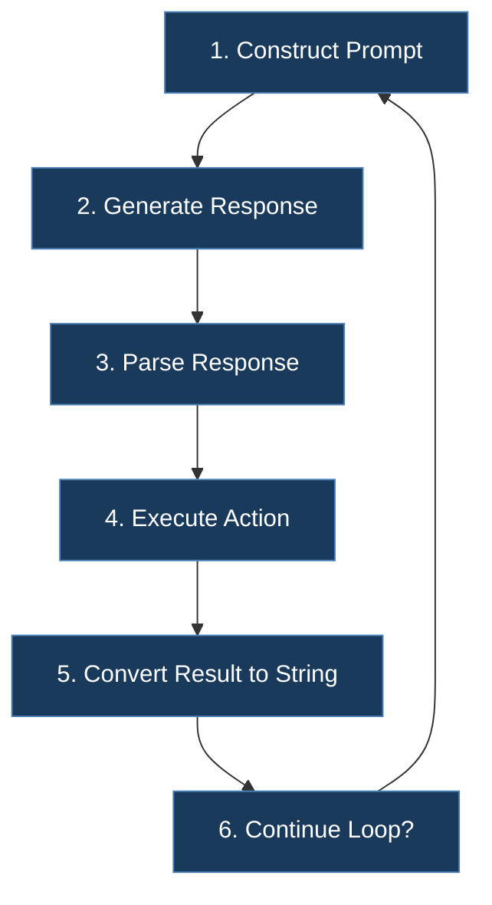
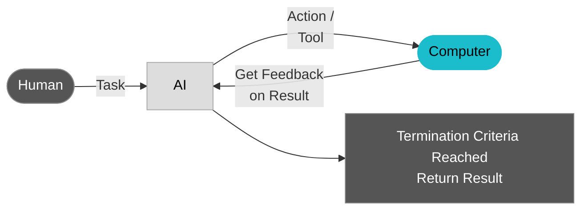
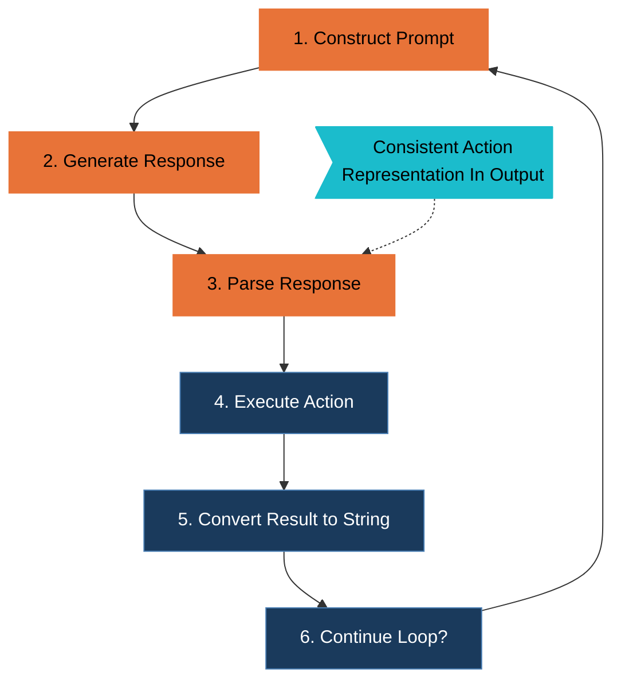

# Agentic AI Concepts

> So it's dynamically altering the step based on the feedback that it is receiving... and that is the key to agentic AI

## Flipped Interaction Pattern

Basic pattern.

Ask one at a time. Adapting the next question based on your answer and that is the agentic part.

Asking a question of a human or asking a question of a database, just the interface changes.
Ask existing systems for data it needs, or tells the system what to do.

LLMs great at translation and excellent experts at language.

Decomposes into a plan.

Protocol droid.

## The Agent Loop

The transformer model was first tested on translation. Translating human language into computation.

Want autonomous agent





Has agency

## Programmatic Prompting for Agents

Simple example

```javascript
import { Message, LLM } from '../shared';

const llm = new LLM();

const messages = [
  Message.system('You are an expert software engineer that prefers functional programming.'),
  Message.user('Write a function to swap the keys and values in an object.'),
];

const response = await llm.generate(messages);
console.log(response);
```

### Key Takeaways

1. Messages are the fundamental unit - Everything you send to an LLM is a list of messages with roles (system, user, assistant)
2. System prompts shape behavior - The system message defines how the LLM will respond, including its persona, formatting, and constraints
3. Structured output is powerful - Asking for JSON responses lets you programmatically process the LLM’s output, which is essential for agents

## Programmatic Prompting for Agents II

The roles include:

- “system”: Provides the model with initial instructions, rules, or configuration for how it should behave throughout the session. This message is not part of the “conversation” but sets the ground rules or context (e.g., “You will respond in JSON.”).
- “user”: Represents input from the user. This is where you provide your prompts, questions, or instructions.
- “assistant”: Represents responses from the AI model. You can include this role to provide context for a conversation that has already started or to guide the model by showing sample responses. These messages are interpreted as what the “model” said in the past.

## Programmatic Prompting for Agents III

> Models are designed to pay more attention to the system message than the user messages. We can “program” the AI agent through system messages.

## Giving Agents Memory

Must include previous context by sending prior messages in the the message array.

LLMs are stateless

## Practicing Programmatic Prompting for Agents

[See QuasiAgent.ts](src/module1/QuasiAgent.ts)

> 📚 Key Takeaways:
1. Memory (conversation history) is essential for multi-turn interactions
2. Prompt chaining lets us build complex outputs step-by-step
3. Memory manipulation gives us control over LLM behavior
4. These techniques are the foundation for full agents

## Adding Structure to AI Agent Outputs



Narrow down so we don't get as much chatty, non-deterministic responses.

### Prompt Engineering + Parsing



*This loop is the zoomed-in view of the AI step in the agent loop — structured output from step 3 is what allows the Computer to execute the correct action.*

## Building your first Agent

[AgentLoop.ts](src/module1/AgentLoop.ts)

```bash
npm run module1:agent
```

- agentRules: system instructions (think CLAUDE.md or pre-prompt)
- memory: record of past session interactions, user input, agent response, results of executed actions

> By allowing the agent to focus on what to do rather than how to do it, we create a system that leverages the LLM for high-level reasoning while relying on well-defined code for execution.
> This separation of reasoning and execution is what makes the agent loop so powerful—it creates a modular, extensible framework that can handle increasingly complex tasks without rewriting the underlying tools.
> This dynamic nature enables the agent to combine its tools in ways that would typically require custom logic, making it far more versatile and capable of addressing a broader range of use cases without additional development overhead.

### AI Agent / Environment Interface

The system message can specify that response be formatted with an action block containing JSON in markdown that can then be consistently parsed.

> \`\`\`action
{"toolName": "readFile", "args": {"fileName": "package.json"}}
\`\`\`

allowing the agent to decide when it has concluded by human specifying when the task is completed, or conditions like more than 2 errors.

> By deciding whether to continue at each step, the agent balances its ability to dynamically adapt to new information with the need to eventually conclude its task. The agent can also be instructed on when to terminate the loop, such as if more than two errors are encountered or if a specific condition is met.


## Quiz

Me:
> I want to understand how AI Agent memory works. So for Claude Code I have the system pre-prompt CLAUDE.md and then there is user input and the model response and the model action. Please describe this and correct my terminology as needed.

---

Claude:

Your mental model is pretty close! Let me clarify and expand it.

**The core concept: context window as "working memory"**

AI agents don't have persistent memory in the way humans do. Everything the model "knows" during a session lives in its **context window** — a fixed-size buffer of tokens that the model can attend to when generating a response. Think of it like RAM: fast, temporary, and lost when the session ends.

**Correcting/refining your terminology**

In Claude Code specifically, the context window is assembled from several layers:

1. **System prompt** — This is what CLAUDE.md becomes. Claude Code reads your CLAUDE.md file(s) and injects their contents as the system prompt (or prepends them to it). This is the right term; "system pre-prompt" is close but "system prompt" is standard. It sets persistent instructions, project context, conventions, etc.

2. **Tool results** — Claude Code is an *agentic* system, meaning the model doesn't just respond with text; it invokes tools (read file, run bash, search codebase, etc.) and the results get appended to the context. So the context grows as the agent acts.

3. **Conversation history** — Your messages and the model's replies are appended turn-by-turn, exactly as in a normal chat.

4. **Model response / assistant turn** — Your term is fine. The model generates text and/or tool calls. "Assistant turn" is the precise term.

5. **Model action** — In agentic frameworks, this is usually called a **tool call** or **tool use**. The model emits a structured request (e.g., `read_file("src/index.ts")`), the host executes it, and the result comes back as a **tool result** in the next context.

**So the full loop looks like this:**

```
System prompt (CLAUDE.md)
  └─ User message
       └─ Assistant turn
            ├─ Tool call → Tool result (appended to context)
            ├─ Tool call → Tool result (appended to context)
            └─ Final text response to user
                 └─ User message  ← next turn starts here
                      └─ (repeat, context keeps growing)
```

**The memory problem**

Because context is finite, long sessions eventually hit the limit and older history gets truncated or summarized. This is why Claude Code:
- Encourages short, focused sessions
- Uses CLAUDE.md as a stable "long-term memory" that's always re-injected
- Sometimes asks you to start a new session for big tasks

**CLAUDE.md as a memory primitive**

CLAUDE.md is essentially a hand-curated external memory store. Since the model itself retains nothing between sessions, you can think of it as the project's "persistent brain" — codifying conventions, decisions, and context that would otherwise be lost when the context window is discarded. Some teams treat updating CLAUDE.md as part of their workflow (e.g., after making an architectural decision, you record it there).

The key insight: **the model has no memory — only context**. All "memory" in AI agents is really just clever context assembly.

---
Me:
> Say I'm using the Claude SDK to write an agent, do each of the different items, system prompt, tool results, etc, have an enum value that is passed to the Claude API?

---
Claude:

Yes, exactly. In the Anthropic SDK, each part of the context is typed/identified. Here's how they map:

**The `role` field — top-level turn identifier**
```typescript
{ role: "user", content: ... }
{ role: "assistant", content: ... }
```
System prompt is separate — it's a top-level field on the request, not a message in the array:
```typescript
{
  model: "claude-opus-4-5",
  system: "You are a helpful assistant...",  // <-- top-level, not in messages[]
  messages: [ ... ]
}
```

**The `type` field — content block identifier**

Within each message's `content` array, each block has a `type`:

| `type` value | What it is |
|---|---|
| `"text"` | Plain text (user input or assistant response) |
| `"tool_use"` | Assistant requesting a tool call |
| `"tool_result"` | User turn returning tool output back to model |
| `"image"` | Image input |
| `"document"` | Document input (e.g. PDF) |

**A concrete agentic loop in TypeScript:**
```typescript
const messages: MessageParam[] = [
  {
    role: "user",
    content: [{ type: "text", text: "What files are in this project?" }]
  },
  {
    role: "assistant",
    content: [{ type: "tool_use", id: "tu_123", name: "list_files", input: { path: "." } }]
  },
  {
    role: "user",  // <-- tool results go in a "user" turn
    content: [{ type: "tool_result", tool_use_id: "tu_123", content: "src/\npackage.json" }]
  }
]
```

The slightly surprising thing: **tool results are sent back in a `user` role turn**, not their own role. The role enum is really just `user | assistant` — the `type` field is what distinguishes a human message from a tool result.

---
Me:
> Is there a historical reason why "tool results are sent back in a `user` role turn, not their own role" Is it because the tool calls were done locally and so represented user to specify they were not done by Claude on the server side?

Claude:

That's a reasonable hypothesis, but the more likely reason is simpler — it's about **the alternating turn structure** that LLMs are trained on.

**The fundamental constraint**

Transformer models trained for conversation expect strictly alternating turns:
```
user → assistant → user → assistant → ...
```
This comes from how they're trained on human conversation data. The model learns to predict the next assistant turn given everything before it. Deviating from this pattern causes problems.

**So where do tool results go?**

When the assistant emits a `tool_use` block, the model is "mid-thought" — it's waiting for external information before it can continue. That response needs to come back in the `user` slot simply because that's the only available slot. There's no `tool` role because adding one would break the binary alternating structure the model expects.

**Your hypothesis isn't wrong though**

The "local execution" framing does capture something real — tools run in *your* process, not on Anthropic's servers, so from the API's perspective the results are genuinely coming from the client side (the "user" side of the connection). So the `user` role is semantically consistent even if that wasn't the primary design reason.

**The broader pattern**

This same convention shows up in OpenAI's API (they do have a `tool` role, but it was added later as a refinement), and in how most multi-modal inputs work — images, documents, etc. all come in on the `user` turn. The `user` role effectively means **"everything that isn't the model."**

---

← Previous | [Next →](02-ai-agents-tools-actions-language.md) | [Home](README.md)
