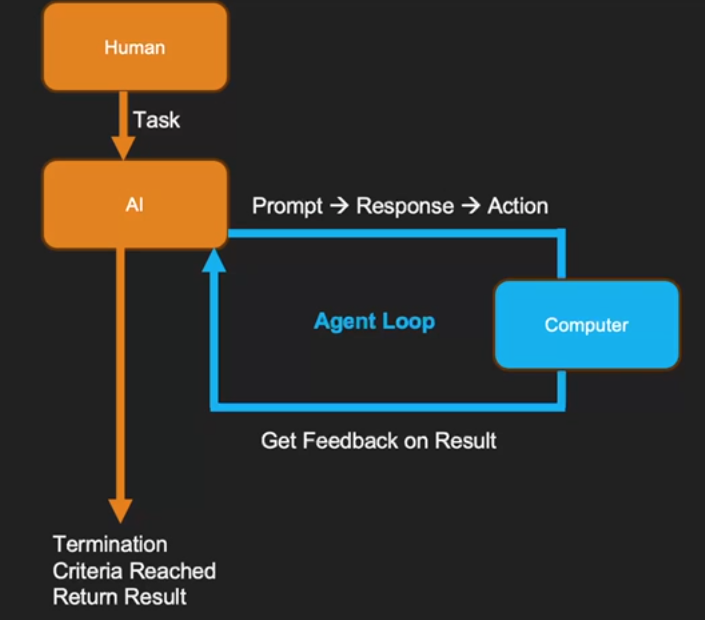
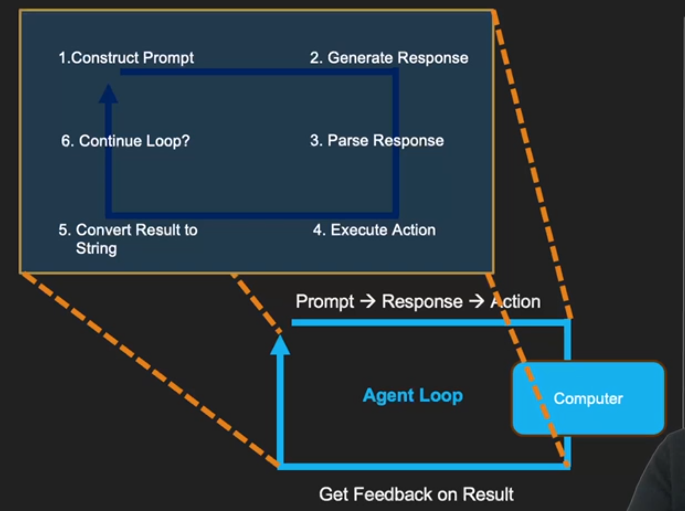

# Agentic AI Concepts

> So it's dynamically altering the step based on the feedback that it is receiving... and that is the key to agentic AI

## Flipped Interaction Pattern

Basic pattern.

Ask one at a time. Adapting the next question based on your answer and that is the agentic part.

Asking a question of a human or asking a question of a database, just the interface changes.
Ask existing systems for data it needs, or tells the system what to do.

LLMs great at translation and excellent experts at language.

Decomposes into a plan.

Protocol droid.

## The Agent Loop

The transformer model was first tested on translation. Translating human language into computation.

Want autonomous agent





Has agency

## Programmatic Prompting for Agents

Simple example

```javascript
import { Message, LLM } from '../shared';

const llm = new LLM();

const messages = [
  Message.system('You are an expert software engineer that prefers functional programming.'),
  Message.user('Write a function to swap the keys and values in an object.'),
];

const response = await llm.generate(messages);
console.log(response);
```

### Key Takeaways

1. Messages are the fundamental unit - Everything you send to an LLM is a list of messages with roles (system, user, assistant)
2. System prompts shape behavior - The system message defines how the LLM will respond, including its persona, formatting, and constraints
3. Structured output is powerful - Asking for JSON responses lets you programmatically process the LLM’s output, which is essential for agents

## Programmatic Prompting for Agents II

The roles include:

- “system”: Provides the model with initial instructions, rules, or configuration for how it should behave throughout the session. This message is not part of the “conversation” but sets the ground rules or context (e.g., “You will respond in JSON.”).
- “user”: Represents input from the user. This is where you provide your prompts, questions, or instructions.
- “assistant”: Represents responses from the AI model. You can include this role to provide context for a conversation that has already started or to guide the model by showing sample responses. These messages are interpreted as what the “model” said in the past.

## Programmatic Prompting for Agents III

> Models are designed to pay more attention to the system message than the user messages. We can “program” the AI agent through system messages.

## Giving Agents Memory

Must include previous context by sending prior messages in the the message array.

LLMs are stateless

## Practicing Programmatic Prompting for Agents

[See QuasiAgent.ts](src/module1/QuasiAgent.ts)

> 📚 Key Takeaways:
1. Memory (conversation history) is essential for multi-turn interactions
2. Prompt chaining lets us build complex outputs step-by-step
3. Memory manipulation gives us control over LLM behavior
4. These techniques are the foundation for full agents

## Adding Structure to AI Agent Outputs


