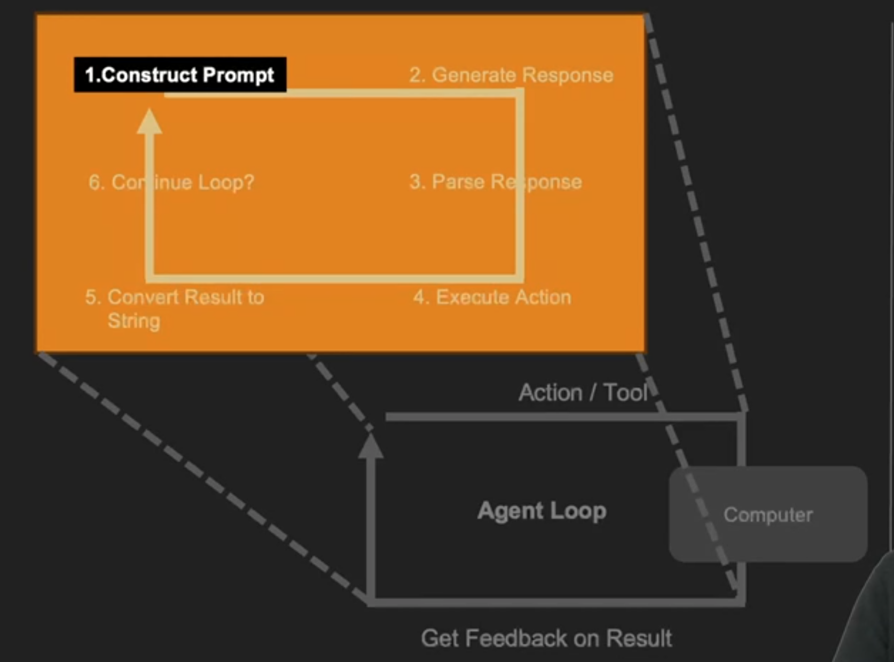
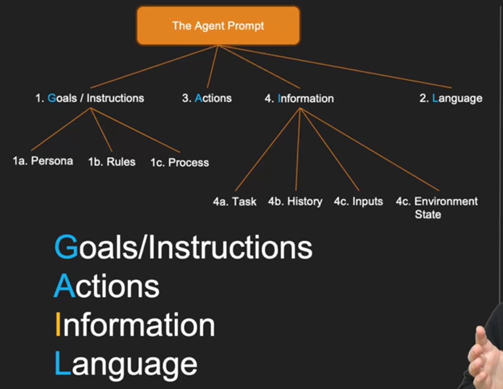
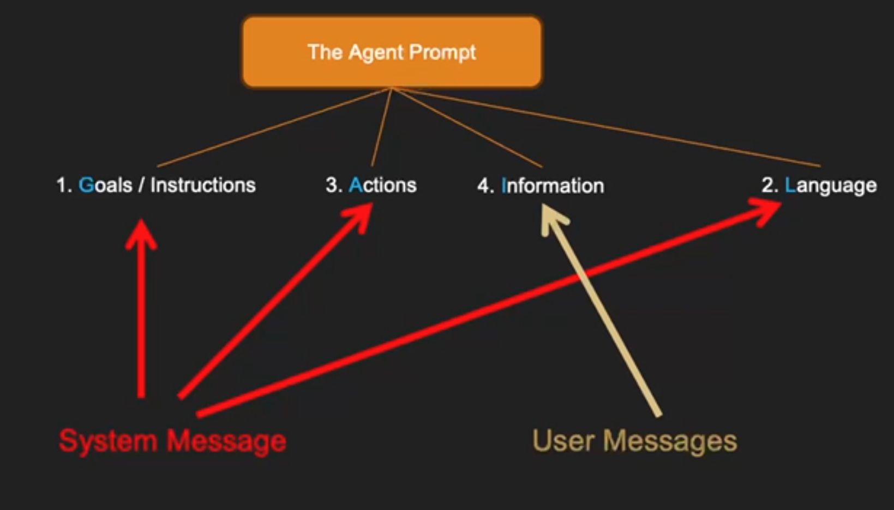

# AI Agents, Tools, Actions, and language

## GAIL - Goals, Actions, Information, Language






1. Goals / instructions
   1. persona
   2. rules - bounded set of constraints
   3. process
2. Actions
   1. what agent can do, interact with env.
3. Information - feedback from action tasks, Input at beginning and output at ends. Decide what next action to take.
   1. task
   2. history
   3. inputs
   4. Environment state / session state
4. Language
   1. output we want



## Giving agents tools

Interact with the world to accomplish the task

constraints on what tools it can use.

these are the actions you can take. Computer system interface as series of actions.

## Tool/Action Descriptions

naming and description of new tools critical for LLM for what it can use it for. (common tools are discoverable using man)


preset the tools, ordering, language (optional use all of them?)

name and description of tool can make or break these systems, contextual information about when to use.

## Tool Results and Agent Feedback

Tool Use Outcome

result of actions from tools (like ls and cat)

complete one step at a time and wait for the result

giving more information from results so it can adapt and update

**error messages are critically important** - so be really clear what is going on and why

feedback is critically important so it can update the state of the world around it.

## Agent Tools

Using JSON Schema is natural for APIs and Agents

Read file

```json
{
  "toolName": "readFile",
  "description": "Reads the content of a specified file.",
  "parameters": {
    "type": "object",
    "properties": {
      "filePath": { "type": "string" }
    },
    "required": ["filePath"]
  }
}
```

Write file

```json
{
  "toolName": "writeDocFile",
  "description": "Writes a documentation file to the docs/ directory.",
  "parameters": {
    "type": "object",
    "properties": {
      "fileName": { "type": "string" },
      "content": { "type": "string" }
    },
    "required": ["fileName", "content"]
  }
}
```

Response

```json
{
  "toolName": "readFile",
  "args": {
    "filePath": "src/file.ts"
  }
}
```

## Using LLM Function Calling for AI-Agent Interaction

Ensure structured and predictable responses by Function calling.

> most LLMs offer function calling APIs that guarantee structured execution. Instead of treating function execution as a free-form text generation task, function calling APIs allow us to explicitly define the tools available to the model using JSON Schema

### Key Benefits


1. Eliminates prompt engineering for structured responses – No need to force the model to output JSON **manually**.
2. Uses standardized JSON Schema – The same format used in API documentation applies seamlessly to AI interactions.
3. Allows mixed text and tool execution – The model can decide whether a tool is necessary or provide a natural response.
4. Simplifies parsing logic – Instead of handling inconsistent outputs, developers only check for tool calls in the response. We don’t need to parse or extract from unstructured text
5. Guarantees syntactically correct arguments – The model automatically ensures arguments match the expected parameter format.


## Try Out LLM Function Calling


## An Agent Loop with function calling

1. No More Custom Parsing Logic
2. Dynamic Execution
3. Unified Text & Action Handling - If no function call is needed, the model responds with a message, allowing mixed conversational and action-driven workflows.
4. Automated Function Execution - The agent dynamically maps the tool name from the model to its corresponding TypeScript function and executes it with the provided arguments.

> By leveraging function calling, we remove unnecessary complexity from the agent loop, allowing the AI to interact with its environment more reliably. This simplification makes AI agents more robust, scalable, and easier to integrate into real-world applications.

## How the function calling agent works

## Agent Tool Design Best Practices

limited set of well defined tools/functions that are specific to the agent's task.

> Agents can use generic tools as well, but more specialized tools are easier to manage and less prone to misuse by the agent.

constraints

| generic | specific |
|---|---|
| `writeFile(filePath, content)` - more reusable | `writeDocumentation(fileName, content)` - writes file only in docs directory, less prone to error |

**Naming plays a crucial role in AI comprehension.** Do not abbreviate.

**Error handling with rich error messages**
More robust and helps AI adjust actions depending on the error

### Instructions in Error Messages

```typescript
if (!fs.existsSync(filePath)) {
  return {
    error: `File '${fileName}' does not exist in the src/ directory. ` +
           `Call the listTypeScriptFiles function to get a list of valid files.`
  };
}
```

Just in time instructions that are targeted to the error.

"tool descriptions must be explicit, structured, and informative."

Principles:

- Use descriptive names.
- Provide structured metadata.
- Leverage JSON Schema for parameters.
- Ensure AI has contextual understanding.
- Include robust error handling.
- Provide informative error messages.
- Inject instructions into error messages.


## Summary discussion with Gemini

Write a 3-4 paragraph discussion of what an AI Agent Loop is. I'm writing a discussion of what an AI agent loop is. Please respond with any corrections or anything I missed.

An AI Agent loop allow the agent to perform multiple tasks and to adapt behavior based on the results of any tool calls (also known as function calling) during the iterations to meet a well described goal. The system prompt is sent with each call to the LLM and a growing list of messages, previous LLM responses, any results of actions or tool calls.

There are three roles for the messages, system (guidelines, constraints, like a pre-prompt), assistant for the LLM responses, and user messages, which in this case would most likely be results of actions.

Agent Loops like regular loops need a terminating condition to prevent an infinite loop. So this can be when the verifiable goal has been met, a user message to terminate if the agent is interactive, or a preset number of loops to perform before exiting.

There is a framework for the Agent Loop called GAIL. The Goals are the instructions, persona, and rules or bounded set of constraints, and process to meet a goal. Actions are what tools an agent can use to meet the goal by interacting with an environment. Those tools are best specified with JSON schema. Information is the results of action tasks, Input at beginning and output at end of a loop iteration, This allows the LLM to decide what next action to take because history of the session is sent with every request. Language is the output we want at the end. This enables us to write agents that adapt and are in charge of meeting their goal with the tools provided so we don't have to specify if/then blocks as we pipe the results back to the agent to decide what the next step to take is.

---

Your summary is a solid foundation for explaining AI agent loops. You’ve correctly identified the shift from linear, hard-coded logic (if/then blocks) to an iterative, goal-oriented architecture.

I’ve polished your explanation and added a few nuanced points you might want to include to make your discussion even more robust.


## 1. Refining the Roles and Message History

While you mentioned three roles, modern agent architectures typically utilize **four** roles to keep the logic clean.
* **System:** The "constitution" or persona.
* **User:** The initial objective or follow-up feedback.
* **Assistant:** The LLM’s reasoning and "thoughts."
* **Tool (or Function):** This is a distinct role in most APIs (like OpenAI or Anthropic). Instead of treating tool results as "User" messages, they are categorized as **Tool** messages. This helps the LLM distinguish between what a *human* said and what an *external system* reported.

## 2. Expanding the GAIL Framework

Your breakdown of GAIL (Goals, Actions, Information, Language) is accurate, but I’d add a small "correction" or clarification on **Information**:
* **Context Window Management:** You mentioned the message list grows. In a professional discussion, it’s worth noting that because context windows are finite, agents often use **summarization** or **vector databases (RAG)** to keep the "Information" relevant without hitting token limits.

## 3. The "Inner Monologue" (Reasoning)
A key part of the loop you might have missed is the **Thought** or **Observation** phase. Most agents follow a **ReAct** (Reason/Act) pattern:
1.  **Thought:** The LLM "thinks" about the current state.
2.  **Action:** The LLM selects a tool.
3.  **Observation:** The agent reads the tool output.
4.  **Repeat:** The LLM updates its thought process based on the observation.

## 4. Error Handling and "Self-Correction"
One of the biggest benefits of a loop is **recovery**. If a tool call fails or returns an error, the agent doesn’t just crash; it sees the error in the "Information" stream and can attempt a different approach or fix its own parameters. This "Self-Correction" is what truly separates an agent from a basic script.

---

### Suggested Polish for your Text
> "An AI Agent loop enables autonomous behavior by iteratively processing feedback from tool calls. Unlike traditional scripts, the agent uses a dynamic history—including **System, User, Assistant, and Tool** messages—to maintain state. To prevent infinite loops, we implement **stopping conditions** such as goal completion, token limits, or human intervention. By using the **GAIL framework**, we shift the burden of logic from rigid if/then statements to an adaptive system where the LLM evaluates the 'Information' from each 'Action' to decide its next step in natural 'Language'."

---

**Would you like me to expand on specific termination strategies, like "Max Iterations" vs. "Goal Verification" steps?**

> yes

Expanding on termination strategies is crucial because, without them, an agent is just a very expensive way to crash a server or run up a bill. In an autonomous loop, the "exit door" needs to be as robust as the logic itself.

Here are the three primary categories of termination strategies:

---

## 1. Safety-Based Constraints (The "Kill Switches")

These are non-negotiable hard limits set by the developer to prevent "runaway" agents.
* **Max Iterations:** A hard cap on how many times the loop can run (e.g., 10 cycles). This is the most common safeguard against logic loops where the LLM repeats the same failing action.
* **Token/Cost Limits:** Monitoring the cumulative "spend" of the session. If the agent exceeds a set budget (e.g., $2.00 or 50,000 tokens), the loop terminates regardless of whether the goal was met.
* **Timeouts:** A temporal wall (e.g., "stop after 60 seconds") to ensure the user isn't waiting indefinitely for an unresponsive tool.

## 2. Goal-Based Termination (The "Mission Accomplished")

This is the "happy path" where the agent realizes it has finished.
* **Self-Reported Completion:** The LLM issues a specific "Final Answer" or `finish` tool call. However, LLMs can be "hallucinatory" and claim they are done when they aren't.
* **External Verifiers:** A second, smaller "Judge" LLM or a hard-coded script checks the output against the original goal. For example, if the goal was "create a file named `report.pdf`," the loop only ends if a file system check confirms that specific file exists.
* **Deterministic Success:** If the agent is using a tool that returns a "Success" status (like an API returning a `200 OK` after a database update), the loop can be programmed to break automatically upon that signal.

## 3. Human-in-the-Loop (The "Supervised" Exit)

For high-stakes agents (e.g., those handling money or deleting data), the loop pauses for a "User Message."
* **Approval Gates:** The agent reaches a "Draft" state and sends a message to the user: *"I have prepared the email. Should I send it or revise?"* The loop terminates or continues based on the human response.
* **Clarification Requests:** If the LLM determines the goal is ambiguous (e.g., "Buy a flight" without a date), it triggers a termination or a "Wait" state to ask the user for more information.

---

### Comparison of Termination Methods

| Strategy | Best For... | Risk |
| :--- | :--- | :--- |
| **Max Iterations** | Preventing infinite loops/cost spikes. | May stop an agent that was 99% finished. |
| **Self-Reported** | Complex, creative tasks. | The agent might "lie" or think it's done. |
| **Verification** | Technical tasks (coding, file management). | Requires extra code or a second LLM call. |
| **Human-in-the-Loop** | High-stakes or ambiguous tasks. | Removes the "autonomous" benefit; slows things down. |

---

### Implementation Tip: The "Final Answer" Schema

A common best practice is to force the agent to use a specific tool called `submit_result` or `final_answer`. By making this the **only** way the agent is allowed to provide the user with the end product, you create a clear, programmatic break-point for your code to stop the loop.

**Would you like me to draft a sample JSON schema for a "Final Answer" tool that handles goal verification?**


> yes

To make your agent loop more robust, you can define a specific tool that the LLM **must** call to exit the loop. This forces the model to consciously decide that the goal is met, rather than just printing text and hoping the loop ends.

Here is a sample JSON schema for a `submit_final_result` tool. This version includes a `verification_check` field, which encourages the LLM to "self-reflect" on whether it actually met the requirements before it exits.

---

### JSON Schema: `submit_final_result`

```json
{
  "name": "submit_final_result",
  "description": "Call this tool only when the user's goal has been fully met and no further actions are required. This will terminate the agent loop.",
  "parameters": {
    "type": "object",
    "properties": {
      "summary": {
        "type": "string",
        "description": "A brief overview of the actions taken to reach the goal."
      },
      "final_output": {
        "type": "string",
        "description": "The actual content, data, or message requested by the user."
      },
      "verification_check": {
        "type": "boolean",
        "description": "Set to true if you have verified that all constraints in the system prompt were followed."
      }
    },
    "required": ["summary", "final_output", "verification_check"]
  }
}
```

---

### Why this works for your Agent Loop:

1.  **Programmatic Breakpoint:** In your code, you can set a condition: `if tool_name == "submit_final_result": break`. This is much cleaner than trying to parse the LLM's prose for phrases like "I am done."
2.  **Structured Hand-off:** By separating the `summary` from the `final_output`, you can present a clean result to the user while keeping the technical "log" of what happened separate.
3.  **Forced Reflection:** Including a `verification_check` as a required boolean acts as a "speed bump." It nudges the LLM to re-evaluate the original system prompt before confirming completion, reducing the chance of premature termination (hallucinated success).

### Integration into your GAIL Discussion:
In the context of **GAIL**, this schema serves as the bridge between **Action** (the tool call) and **Language** (the final output). It ensures that the **Information** passed back to the system is structured enough to reliably stop the loop.

**Would you like me to show you a Python pseudocode example of how the loop handles this specific tool call to exit?**

</details>
