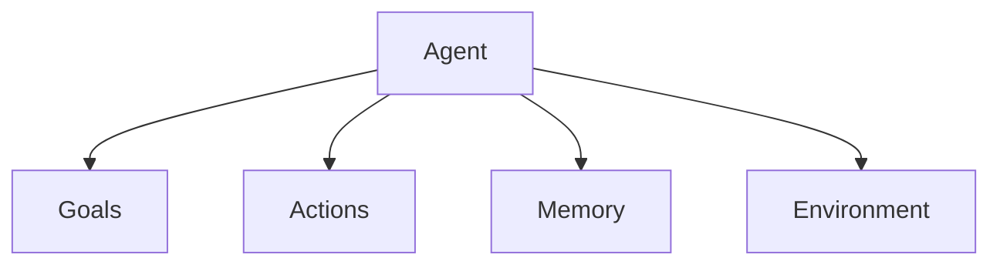

# GAME: A Conception Framework for AI Agents

Playing around in interactive way, renaming tools, etc.

## Designing AI Agents with GAME

"structure an agent’s architecture before writing a single line is crucial."

> GAME framework provides a methodology for systematically defining an agent’s goals, actions, memory, and environment, allowing us to approach the design in a logical and modular fashion. By thinking through how these components interact within the agent loop, we can sketch out the agent’s behavior and dependencies before diving into code implementation. This structured approach not only improves clarity but also makes the transition from design to coding significantly smoother and more efficient.

