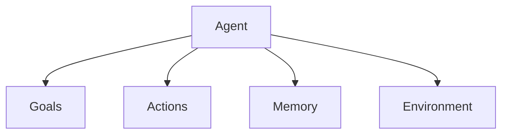
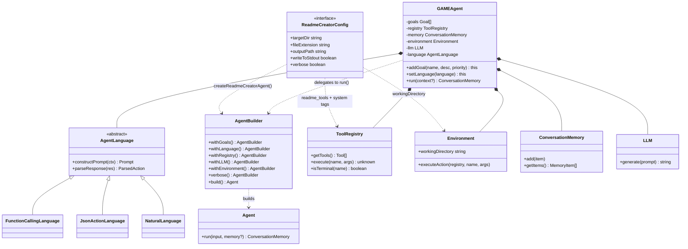
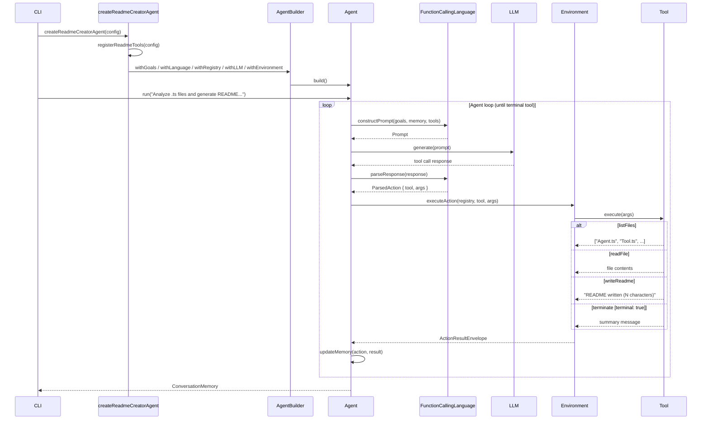

# GAME: A Conception Framework for AI Agents

- [Designing AI Agents with GAME](#designing-ai-agents-with-game)
- [Simulating AI Agents in Conversations](#simulating-ai-agents-in-conversations)
- [Simulating GAME Agents in Conversation](#simulating-game-agents-in-conversation)
  - [Sample Prompt for simulation](#sample-prompt-for-simulation)
  - [Example: File Analysis Agent](#example-file-analysis-agent)
  - [Example: Proactive Coder Agent](#example-proactive-coder-agent)
  - [Building an example library](#building-an-example-library)
  - [Summary](#summary)
- [Modular AI Agent Design](#modular-ai-agent-design)
- [Agent Loop Customization](#agent-loop-customization)
- [Implementing GAME in Code](#implementing-game-in-code)
- [How Your Agent Communicates with the LLM: The Agent Language](#how-your-agent-communicates-with-the-llm-the-agent-language)
- [Putting It All Together: Document Your Code with a README Agent](#putting-it-all-together-document-your-code-with-a-readme-agent)
  - [Example Readme Creator Agent Implementation](#example-readme-creator-agent-implementation)
  - [Class Diagram — Module 3 Structure](#class-diagram--module-3-structure)
  - [Sequence Diagram — README Agent Execution Loop](#sequence-diagram--readme-agent-execution-loop)




Playing around in interactive way, renaming tools, etc.

## Designing AI Agents with GAME

"structure an agent’s architecture before writing a single line is crucial."


> GAME framework provides a methodology for systematically defining an agent’s goals, actions, memory, and environment, allowing us to approach the design in a logical and modular fashion. By thinking through how these components interact within the agent loop, we can sketch out the agent’s behavior and dependencies before diving into code implementation. This structured approach not only improves clarity but also makes the transition from design to coding significantly smoother and more efficient.

> You can think of Actions as an “interface” specifying the available capabilities, while the Environment acts as the “implementation” that brings those capabilities to life. For example, an agent might have an action called readFile(), which is simply a placeholder in the Actions layer. The Environment then provides the actual logic, handling file I/O operations and error handling to ensure the action is executed correctly.

## Simulating AI Agents in Conversations

Agent loop like an automated conversation, so can simulate with rapid iteration/prototyping using conversation.

Rapid cheap iteration to refine before coding.

## Simulating GAME Agents in Conversation

before implementing an agent, we want to verify that:

1. The goals are achievable with the planned actions
2. The memory requirements are reasonable
3. The actions available are sufficient to solve the problem
4. The agent can make appropriate decisions with the available information

### Sample Prompt for simulation

```text
I'd like to simulate an AI agent that I'm designing.
The agent will be built using these components:

Goals: [List your goals]
Actions: [List available actions]

At each step, your output must be an action to take.

Stop and wait and I will type in the result of
the action as my next message.

Ask me for the first task to perform.
```

### Example: File Analysis Agent

```text
I'd like to simulate an AI agent that I'm designing.
The agent will be built using these components:

Goals:
* [Priority: 10] discover: Find out what files exist in the directory
* [Priority: 8] analyze: Read and understand the package.json file
* [Priority: 5] summarize: Provide a summary of the project

Actions available:
* listFiles(): Lists all files in the current directory
* readFile(fileName: string): Reads the contents of a file
* completeGoal(goalName: string): Mark a goal as completed
* terminate(message: string): Ends the conversation and provides final output to user

At each step, your output must be an action to take.

Stop and wait and I will type in the result of
the action as my next message.

Ask me for the first task to perform.
```

### Example: Proactive Coder Agent

```text
I'd like to simulate an AI agent that I'm designing. The agent will be built using these components:

Goals:
* [Priority: 10] Find potential code enhancements
* [Priority: 9] Ensure changes are small and self-contained
* [Priority: 8] Get user approval before making changes
* [Priority: 7] Maintain existing interfaces

Actions available:
* listProjectFiles(): Lists all files in the current directory
* readProjectFile(fileName: string): Reads the content of a TypeScript file from the project directory. The fileName should be one previously returned by listProjectFiles()
* askUserApproval(proposal: string): Requests user approval for a proposed change
* editProjectFile(fileName: string, changes: object): Applies changes to a file
* completeGoal(goalName: string): Mark a goal as completed
* terminate(message: string): Ends the conversation and provides final output to user

At each step, your output must be an action to take.

Stop and wait and I will type in the result of
the action as my next message.

Ask me for the first task to perform.
```

> At the end of your simulation sessions, ask the agent to reflect on its experience. What tools did it wish it had? Were any instructions unclear? Which goals were too vague?

### Building an example library

> When you see the agent make a particularly good decision, save that exchange. When it makes a poor choice, save that too. These examples become invaluable when you move to implementation – they can be used to craft better prompts and test cases... These examples help you understand what patterns to encourage or discourage in your implemented agent. They also serve as test cases – your implemented agent should handle these scenarios correctly.

### Summary

> Through this iterative process of simulation, observation, and refinement, you develop a deep understanding of how your agent will behave in the real world... And simulation helps you verify that structure before you write a single line of implementation code.

## Modular AI Agent Design

> Benefits of the GAME Framework
> This modular approach provides several key benefits:

> 1. Separation of Concerns: Each component (Goals, Actions, Memory, Environment) has a clear, focused responsibility.
> 2. Reusability: The core agent loop can remain unchanged while we swap out different goals, actions, or memory strategies.
> 3. Testability: Each component can be tested independently.
> 4. Extensibility: We can easily add new actions, change memory strategies, or modify goals without touching the core loop.

## Agent Loop Customization

The Flow of Information Through the Loop

1. The `Memory` provides context about past decisions and results
2. The `Goals` define what the agent is trying to accomplish
3. The `ActionRegistry` defines what tools the agent can use
4. The `AgentLanguage` formats `Goals`, `Actions`, and `Memory` into a prompt
5. The LLM generates a response choosing an action
6. The `AgentLanguage` parses the response into a structured action
7. The `Environment` executes the action with the given arguments
8. The result is stored back in memory
9. The loop repeats until termination

## Implementing GAME in Code

Benefits of the GAME Structure (see benefits of the GAME Framework above)

1. Better Organization: Each component (Goals, Actions, Memory, Environment) has a clear responsibility
2. Reusability: Swap environments for testing, share tools across agents
3. Extensibility: Add new goals and actions without modifying the core loop

The same agent loop works with completely different behaviors just by changing the GAME components.

## How Your Agent Communicates with the LLM: The Agent Language

Comparison

| Strategy | Use Case | Reliability | Shows Reasoning |
|----------|----------|-------------|-----------------|
| NaturalLanguage | Simple Q&A | High | Yes |
| JsonActionLanguage | Debugging | Medium | Yes |
| FunctionCallingLanguage | Production | Highest | No |

## Putting It All Together: Document Your Code with a README Agent

### Example Readme Creator Agent Implementation

* [03-readme-creator.md](03-readme-creator.md): A detailed walkthrough of how to implement a README generator agent using the GAME framework. It covers defining goals, creating tools for file system operations, setting up the environment, and choosing an agent language. This serves as a practical example of how to apply the concepts from this module to build a real-world agent that can analyze source code and generate documentation.
* [ReadmeCreatorAgent.ts](src/module3/ReadmeCreatorAgent.ts): A practical CLI tool that uses the GAME framework to analyze source files in a directory and generate a README.md. It exposes a command-line interface to configure the target directory, file extension, and output path, then uses the writeReadme mechanism to save the README. Includes options such as --ext, --dir, --output, --stdout, and --verbose, with sensible defaults. Demonstrates how the same agent and tool primitives can be used for non-LLM tasks like code documentation generation.
* [readmeTools.ts](src/module3/readmeTools.ts): Tooling utilities that help the agent discover and read project files, register tools, and output results (e.g., list files, read files, and terminate). These expose a consistent interface for the agent to request file-system operations as tools within a controlled registry.
* [readme.md](src/module3/readme.md): A comprehensive README generated by the ReadmeCreatorAgent. It explains the architecture, implementation, and usage of the ReadmeCreatorAgent, along with instructions on how to run it and extend it. This was generated with this command line

    ```bash
    npm run module3:readme -- \
    --dir src/module3 \
    --output src/module3/readme.md \
    --ext ts \
    --verbose`
    ```

### Class Diagram — Module 3 Structure

The class diagram shows how the GAME components compose together and how `GAMEAgent` delegates to `AgentBuilder` at runtime. The `AgentLanguage` hierarchy is the key extension point — swapping the language changes how the agent communicates without touching goals, tools, or memory.



### Sequence Diagram — README Agent Execution Loop

The sequence diagram shows what actually happens when the agent runs. Each iteration the language layer constructs a prompt (goals + memory + available tools), the LLM picks a tool, and the environment executes it. The loop continues until a `terminal: true` tool is called.



---

[← Previous](02-ai-agents-tools-actions-language.md) | [Next →](04-rethinking-software.md) | [Home](README.md)
