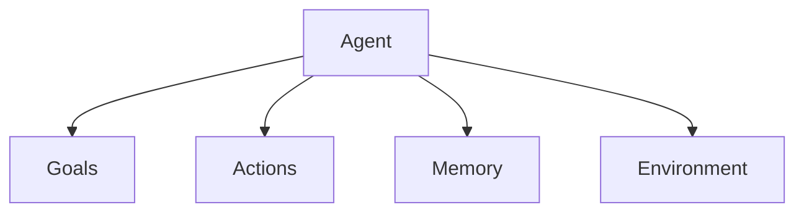

# GAME: A Conception Framework for AI Agents



Playing around in interactive way, renaming tools, etc.

## Designing AI Agents with GAME

"structure an agent’s architecture before writing a single line is crucial."


> GAME framework provides a methodology for systematically defining an agent’s goals, actions, memory, and environment, allowing us to approach the design in a logical and modular fashion. By thinking through how these components interact within the agent loop, we can sketch out the agent’s behavior and dependencies before diving into code implementation. This structured approach not only improves clarity but also makes the transition from design to coding significantly smoother and more efficient.

> You can think of Actions as an “interface” specifying the available capabilities, while the Environment acts as the “implementation” that brings those capabilities to life. For example, an agent might have an action called readFile(), which is simply a placeholder in the Actions layer. The Environment then provides the actual logic, handling file I/O operations and error handling to ensure the action is executed correctly.

## Simulating AI Agents in Conversations

Agent loop like an automated conversation, so can simulate with rapid iteration/prototyping using conversation.

Rapid cheap iteration to refine before coding.

## Simulating GAME Agents in Conversation

before implementing an agent, we want to verify that:

1. The goals are achievable with the planned actions
2. The memory requirements are reasonable
3. The actions available are sufficient to solve the problem
4. The agent can make appropriate decisions with the available information

### Sample Prompt for simulation

```text
I'd like to simulate an AI agent that I'm designing.
The agent will be built using these components:

Goals: [List your goals]
Actions: [List available actions]

At each step, your output must be an action to take.

Stop and wait and I will type in the result of
the action as my next message.

Ask me for the first task to perform.
```

### Example: File Analysis Agent

```text
I'd like to simulate an AI agent that I'm designing.
The agent will be built using these components:

Goals:
* [Priority: 10] discover: Find out what files exist in the directory
* [Priority: 8] analyze: Read and understand the package.json file
* [Priority: 5] summarize: Provide a summary of the project

Actions available:
* listFiles(): Lists all files in the current directory
* readFile(fileName: string): Reads the contents of a file
* completeGoal(goalName: string): Mark a goal as completed
* terminate(message: string): Ends the conversation and provides final output to user

At each step, your output must be an action to take.

Stop and wait and I will type in the result of
the action as my next message.

Ask me for the first task to perform.
```

### Example: Proactive Coder Agent

```text
I'd like to simulate an AI agent that I'm designing. The agent will be built using these components:

Goals:
* [Priority: 10] Find potential code enhancements
* [Priority: 9] Ensure changes are small and self-contained
* [Priority: 8] Get user approval before making changes
* [Priority: 7] Maintain existing interfaces

Actions available:
* listProjectFiles(): Lists all files in the current directory
* readProjectFile(fileName: string): Reads the content of a TypeScript file from the project directory. The fileName should be one previously returned by listProjectFiles()
* askUserApproval(proposal: string): Requests user approval for a proposed change
* editProjectFile(fileName: string, changes: object): Applies changes to a file
* completeGoal(goalName: string): Mark a goal as completed
* terminate(message: string): Ends the conversation and provides final output to user

At each step, your output must be an action to take.

Stop and wait and I will type in the result of
the action as my next message.

Ask me for the first task to perform.
```

> At the end of your simulation sessions, ask the agent to reflect on its experience. What tools did it wish it had? Were any instructions unclear? Which goals were too vague?

### Building an example library

> When you see the agent make a particularly good decision, save that exchange. When it makes a poor choice, save that too. These examples become invaluable when you move to implementation – they can be used to craft better prompts and test cases... These examples help you understand what patterns to encourage or discourage in your implemented agent. They also serve as test cases – your implemented agent should handle these scenarios correctly.

### Summary

> Through this iterative process of simulation, observation, and refinement, you develop a deep understanding of how your agent will behave in the real world... And simulation helps you verify that structure before you write a single line of implementation code.
